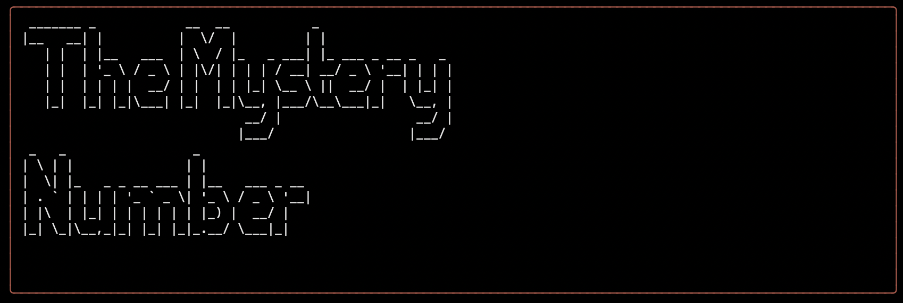
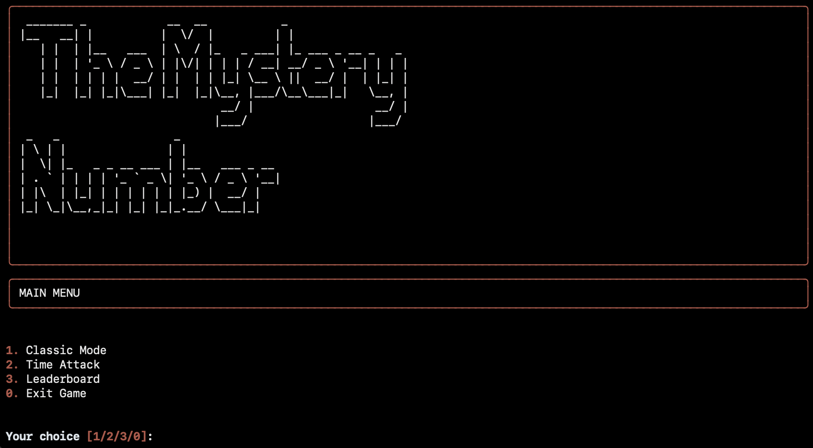

# The Mystery Number

## Description
The Mystery Number is a game in which you have to guess a number between 1 and 100.
There are 2 game modes : Classic (you have a limited number of attempts) and Time Attack (you have a limited time to guess)

## Installation

Clone the repository

```shell
git clone https://github.com/Chr1s2564/TheMysteryNumber.git
cd the-mystery-number
```

Create and activate a virtual environment

```shell
python -m venv env
#On Windows:
.env\Scripts\activate

# On macOS and Linux:
source env/bin/activate
```

Install dependencies

```shell
pip install -r requirements.txt
```
## How to play The Mystery Number


There are 2 game modes :
 - [x] Classic mode
 
You have to guess a number between 1 and 100, in a certain amount of attempts (10, 5, or 3 depending on choosen difficulty)
 - [x] Time Attack

You have to guess a number between 1 and 100, in a certain amount of time (60, 30, or 10 seconds depending on choosen difficulty)

The game also features two leaderboard (one for each game mode) in order to see who is the best player

## Projet Source

I took this project idea from [Roadmap.sh](https://roadmap.sh/projects/number-guessing-game)

## Back Story

I took the liberty to add another game mode to the game, in order to learn how to deal with threading. It is also my first try at rich so definitely learn a lot on this project. 
